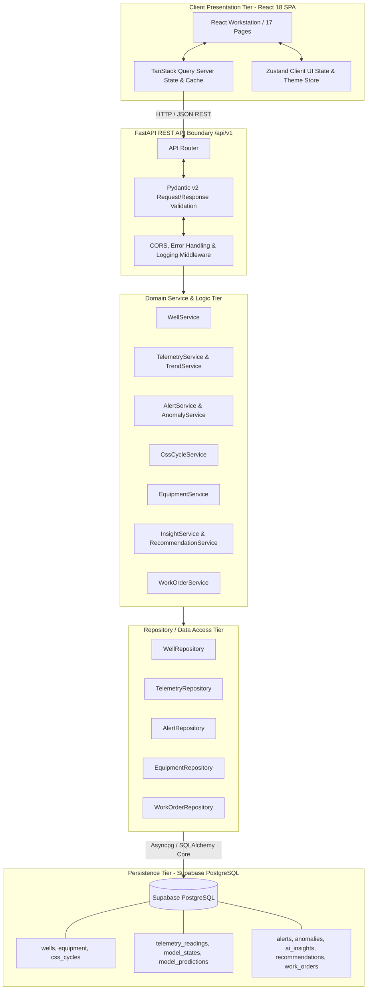

# Well Twin — Master Project Specification

## 1. Executive Summary & Master Vision

**Well Twin** is an authoritative, engineer-first digital twin and decision-support platform engineered specifically for heavy-oil thermal recovery operations using Cyclic Steam Stimulation (CSS) and Sucker Rod Pumping (SRP).

Unlike generic industrial dashboards or disconnected point analytics, Well Twin unifies the complete subsurface-to-surface physics into four coupled digital twin models:
1. **Reservoir & Thermal Twin**: Steam chamber radial growth ($R = 18.4\text{ m}$), thermal dissipation, and temperature-dependent viscosity falloff.
2. **Wellbore Hydrodynamics Twin**: Multiphase flowing pressure/temperature gradients, liquid holdup, and friction vs. hydrostatic losses.
3. **SRP Mechanical Lift Twin**: Downhole and surface dynamometer card analysis, fluid pound inception ($2.80\text{ m}$), and Goodman rod string fatigue stress.
4. **Surface Production Twin**: Net oil/water/gas separation tracking, flowline hydraulics, and automated model drift detection ($-7.0\%$ oil deficit).

Well Twin provides engineers with transparent physical explainability:
$$\text{Reservoir Cooling } (\Delta T = -3.8^\circ\text{C}) \longrightarrow \text{Viscosity Surge } (+11.0\%) \longrightarrow \text{Pump Loading } (+6.2\%) \longrightarrow \text{Fillage Drop } (-3.6\%) \longrightarrow \text{Net Oil Deficit } (-7.0\%)$$

---

## 2. Authoritative Development Roadmap

The project follows a strict 5-phase engineering sequence. There is no temporary or in-memory backend stage.

```text
================================================================================
PHASE 1 — FRONTEND (COMPLETED)
React 18 + TypeScript + Vite + Tailwind CSS
        ↓
Feature-Based Architecture + Typed Mock Services
        ↓
Complete Dual-Theme Engineer Workstation (17 Routes)
================================================================================
                                ↓
================================================================================
PHASE 2 — BACKEND + DATABASE (CURRENT / ACTIVE)
FastAPI REST API (/api/v1)
        ↓
Domain Service Layer & Pydantic Validation
        ↓
Repository Layer (Async SQLAlchemy)
        ↓
Supabase PostgreSQL (ACID Relational Persistence)
        ↓
React Workstation API Integration (TanStack Query)
================================================================================
                                ↓
================================================================================
PHASE 3 — ANALYTICS + ML
        ↓
Engineering Calculations & Fluid Properties
        ↓
Physics-Informed Well Health Scoring
        ↓
Multivariate Statistical & Machine Learning Anomaly Detection
        ↓
Production Prediction & Quantitative Model Drift
================================================================================
                                ↓
================================================================================
PHASE 4 — AI INTELLIGENCE
        ↓
AI Insights Engine with Grounded Telemetry Evidence
        ↓
Prescriptive Recommendations with Production Impact Preview
        ↓
Closed-Loop Decision Support Workflow
================================================================================
                                ↓
================================================================================
PHASE 5 — REAL DATA + PRODUCTION
        ↓
SCADA & Industrial Historian Ingestion Pipeline
        ↓
Supabase Authentication, Row Level Security (RLS) & RBAC
        ↓
Production Hardening, CI/CD, Observability & Cloud Deployment
================================================================================
```

---

## 3. Phase 1 Completion Summary (COMPLETED)

Phase 1 has delivered the complete presentation and interaction tier of the Well Twin platform:

- **Core Technologies**: React 18, TypeScript, Vite, Tailwind CSS, TanStack Query, Zustand, React Router 6, Lucide React, and custom SVG visualizers.
- **Dual-Theme Design System**:
  - Technical Light Mode baseline (crisp white `#FFFFFF`, subtle borders `#E2E8F0`, low visual noise).
  - Industrial Dark Mode Control Room (`#0B0F14` canvas, `#151C24` card panels, `#38BDF8` cyan accents).
  - Unconditional default to Light Mode for all new visitors.
  - Header toggle switch with instant transition and `localStorage` persistence.
- **17 Interactive Workstation Pages**:
  - `OverviewPage.tsx`: Executive command center with KPI cards, well health score, physical cause chain, model drift alert, and predicted vs. actual production curve.
  - `DigitalTwinOverviewPage.tsx`: Visual coupling map with thermodynamic, hydraulic, and mechanical data bridges.
  - `WellStatePage.tsx`: Subsurface vs. surface state telemetry tables with live sparklines.
  - `ReservoirPage.tsx`: Steam plume radial heat bubble SVG ($R=18.4\text{ m}$), isotherm selector, and mobile oil saturation curves.
  - `WellborePage.tsx`: Multiphase hydraulic profile to $1,420\text{ m}$ TD, flow regimes, and pressure drop breakdown.
  - `SrpPage.tsx`: Interactive SVG dynamometer card (surface vs. downhole, fluid pound marker @ $2.80\text{ m}$, Goodman fatigue stress analysis).
  - `SurfaceProductionPage.tsx`: Actual vs. predicted production tracking, test separator validation, and waterfall attribution.
  - `TrendsPage.tsx`: Multi-parameter comparative time-series with preset variable pairs (`temp_visc`, `fillage_eff`, `pred_act`, `pip_inflow`).
  - `CssCyclePage.tsx`: 4-phase lifecycle timeline (Injection $\to$ Soak $\to$ Production $\to$ Cooling), historical cycle comparisons, and CSOR tracking.
  - `AlertsPage.tsx`: Severity-filtered operational alert grid with Acknowledge/Resolve state transitions and root-cause details.
  - `AnomaliesPage.tsx`: Sensor deviation heatbars, physical root-cause attribution, and severity scoring.
  - `AiInsightsPage.tsx`: Physics-grounded diagnostic cards with structured evidence arrays and projected production delta ($+13.8\text{ BOPD}$).
  - `EquipmentPage.tsx`: Subsurface and surface asset catalog, health scores, Goodman stress check (Grade D rods at $86.2\%$), and maintenance schedules.
  - `WellDiagramPage.tsx`: Technical wellbore completion schematic SVG with casings, tubing, downhole pump, and depth-correlated P/T profiles.
  - `ModelComparisonPage.tsx`: Subsystem model validation matrix with twin predicted vs. SCADA measured values, residual deviation, and interactive recalibration simulation.
  - `RecommendationsPage.tsx`: 7-field engineering cards, visual workflow strip (`Alert` $\to$ `Insight` $\to$ `Recommendation` $\to$ `Work Order`), and Accept/Reject interactions.
  - `WorkOrdersPage.tsx`: Industrial dispatch table, priority filtering, and modal creation workflow.
- **Data Provenance System**: Explicit badging across all metrics:
  - `OBSERVED`: Measured SCADA sensor readings.
  - `ESTIMATED`: Soft-sensor & thermodynamic inferences.
  - `MODEL PREDICTION`: Coupled digital twin solver outputs.
  - `ACTUAL`: Well test separator & manual gauges.
  - `SYNTHETIC`: Deterministic test scenario dataset (Baghewala Well BW-017, CSS Cycle 4, Day 38).
- **Verification**: 0 TypeScript errors, clean Vite production build in 10.75s, HTTP 200 OK on local dev server.

> [!IMPORTANT]
> All Phase 1 views are driven by a centralized, deterministic synthetic dataset. No live backend, database, ML engine, or SCADA ingestion pipeline is active in Phase 1.

---

## 4. Master System Architecture (Phase 2 & Beyond)



### Architectural Boundaries & Security Rules:
1. **Frontend Isolation**: The React client communicates **strictly with FastAPI** via `/api/v1`. The frontend must NEVER connect directly to Supabase for application business operations.
2. **Service Role Protection**: The `SUPABASE_SERVICE_ROLE_KEY` must NEVER be exposed to or bundled into the frontend application.
3. **Pydantic Validation**: All inbound payloads and outbound responses must pass through strict Pydantic schemas.
4. **Controlled Demo Mode**: The frontend retains an offline demonstration replica mode (`VITE_ENABLE_DEMO_FALLBACK=true`), ensuring SIH evaluations continue smoothly if network connectivity to the cloud database is interrupted.

---

## 5. Phase 2 Technical Architecture (FastAPI + Supabase)

### Backend Directory Layout
```text
backend/
├── app/
│   ├── main.py                       # FastAPI application & lifecycle
│   ├── core/
│   │   ├── config.py                 # Pydantic Settings (.env loader)
│   │   ├── security.py               # Security helpers
│   │   └── logging.py                # Structured JSON logging
│   ├── api/
│   │   └── v1/
│   │       ├── router.py             # Central /api/v1 router
│   │       ├── health.py             # /health endpoint
│   │       ├── wells.py              # /wells endpoints
│   │       ├── telemetry.py          # /wells/{id}/telemetry endpoints
│   │       ├── trends.py             # /wells/{id}/trends endpoints
│   │       ├── alerts.py             # /wells/{id}/alerts & mutation endpoints
│   │       ├── anomalies.py          # /wells/{id}/anomalies endpoints
│   │       ├── css_cycles.py         # /wells/{id}/css-cycles endpoints
│   │       ├── equipment.py          # /wells/{id}/equipment endpoints
│   │       ├── insights.py           # /wells/{id}/insights endpoints
│   │       ├── recommendations.py    # /wells/{id}/recommendations endpoints
│   │       └── work_orders.py        # /work-orders CRUD endpoints
│   ├── schemas/                      # Pydantic v2 schemas
│   ├── models/                       # SQLAlchemy declarative models
│   ├── repositories/                 # Async database query repositories
│   ├── services/                     # Domain services
│   ├── db/
│   │   ├── connection.py             # Async engine & sessionmaker
│   │   ├── migrations/               # Alembic migrations
│   │   └── seed.py                   # Seeds Phase 1 deterministic scenario
│   └── tests/                        # Pytest automated test suite
├── requirements.txt
├── .env.example
└── README.md
```

### API Endpoint Matrix (`/api/v1`)
| Endpoint | Method | Purpose | Schema / Return |
| :--- | :--- | :--- | :--- |
| `/health` | `GET` | System & DB health check | `HealthCheckResponse` |
| `/wells` | `GET` | List all wells | `List[WellSummaryResponse]` |
| `/wells/{id}` | `GET` | Get full well master record | `WellDetailResponse` |
| `/wells/{id}/health` | `GET` | Get aggregated & subsystem health | `WellHealthResponse` |
| `/wells/{id}/state` | `GET` | Get current subsurface/surface state | `WellStateResponse` |
| `/wells/{id}/telemetry` | `GET` | Query time-series telemetry | `PaginatedTelemetryResponse` |
| `/wells/{id}/telemetry/latest` | `GET` | Latest instantaneous telemetry | `TelemetryReadingResponse` |
| `/wells/{id}/trends` | `GET` | Downsampled multi-metric trends | `List[TrendPointResponse]` |
| `/wells/{id}/css-cycles` | `GET` | List all CSS cycles for well | `List[CssCycleResponse]` |
| `/wells/{id}/css-cycles/{cycle_id}` | `GET` | Get specific cycle breakdown | `CssCycleDetailResponse` |
| `/wells/{id}/equipment` | `GET` | Equipment registry & stress indices | `List[EquipmentResponse]` |
| `/wells/{id}/alerts` | `GET` | Filter operational alerts | `List[AlertResponse]` |
| `/alerts/{id}/acknowledge` | `POST` | Acknowledge active alert | `AlertResponse` |
| `/alerts/{id}/resolve` | `POST` | Resolve alert with notes | `AlertResponse` |
| `/wells/{id}/anomalies` | `GET` | Get detected multivariate anomalies | `List[AnomalyResponse]` |
| `/wells/{id}/insights` | `GET` | Get physics-grounded AI insights | `List[AiInsightResponse]` |
| `/wells/{id}/recommendations` | `GET` | Get prescriptive recommendations | `List[RecommendationResponse]` |
| `/recommendations/{id}/status` | `POST` | Accept/Reject recommendation | `RecommendationResponse` |
| `/work-orders` | `GET` | List all field work orders | `List[WorkOrderResponse]` |
| `/work-orders/{id}` | `GET` | Get work order details | `WorkOrderResponse` |
| `/work-orders` | `POST` | Create new work order | `WorkOrderResponse` |
| `/work-orders/{id}` | `PATCH` | Update status, priority, assignee | `WorkOrderResponse` |

---

## 6. Relational Database Specification (Supabase PostgreSQL)

### Primary Relational Tables

#### 1. `wells`
Master registry for assets:
```sql
CREATE TABLE wells (
    id UUID PRIMARY KEY DEFAULT gen_random_uuid(),
    well_code VARCHAR(50) UNIQUE NOT NULL,
    name VARCHAR(100) NOT NULL,
    field_name VARCHAR(100) NOT NULL,
    basin VARCHAR(100) NOT NULL,
    latitude DOUBLE PRECISION NOT NULL,
    longitude DOUBLE PRECISION NOT NULL,
    formation VARCHAR(100) NOT NULL,
    reservoir_depth_m DOUBLE PRECISION NOT NULL,
    total_depth_m DOUBLE PRECISION NOT NULL,
    crude_api DOUBLE PRECISION NOT NULL,
    dead_oil_viscosity_cp DOUBLE PRECISION NOT NULL,
    current_cycle INTEGER NOT NULL DEFAULT 4,
    operating_phase VARCHAR(50) NOT NULL,
    artificial_lift_type VARCHAR(50) NOT NULL,
    status VARCHAR(20) NOT NULL DEFAULT 'Active',
    created_at TIMESTAMPTZ NOT NULL DEFAULT now(),
    updated_at TIMESTAMPTZ NOT NULL DEFAULT now()
);
```

#### 2. `telemetry_readings`
High-frequency physical telemetry readings:
```sql
CREATE TABLE telemetry_readings (
    id BIGSERIAL PRIMARY KEY,
    well_id UUID NOT NULL REFERENCES wells(id) ON DELETE CASCADE,
    timestamp TIMESTAMPTZ NOT NULL,
    oil_rate DOUBLE PRECISION,
    water_rate DOUBLE PRECISION,
    steam_rate DOUBLE PRECISION,
    gas_rate DOUBLE PRECISION,
    bottomhole_pressure DOUBLE PRECISION,
    bottomhole_temperature DOUBLE PRECISION,
    wellhead_pressure DOUBLE PRECISION,
    wellhead_temperature DOUBLE PRECISION,
    casing_pressure DOUBLE PRECISION,
    tubing_pressure DOUBLE PRECISION,
    flowline_pressure DOUBLE PRECISION,
    pump_speed DOUBLE PRECISION,
    stroke_rate DOUBLE PRECISION,
    stroke_length_m DOUBLE PRECISION,
    pump_fillage DOUBLE PRECISION,
    fluid_level_m DOUBLE PRECISION,
    motor_current DOUBLE PRECISION,
    motor_power_kw DOUBLE PRECISION,
    torque DOUBLE PRECISION,
    vibration DOUBLE PRECISION,
    peak_polished_rod_load DOUBLE PRECISION,
    minimum_polished_rod_load DOUBLE PRECISION,
    provenance VARCHAR(30) NOT NULL DEFAULT 'OBSERVED',
    created_at TIMESTAMPTZ NOT NULL DEFAULT now()
);

CREATE INDEX idx_telemetry_well_timestamp ON telemetry_readings (well_id, timestamp DESC);
```

#### 3. `model_states` & `model_predictions`
Stores digital twin subsystem states and predictive verification:
```sql
CREATE TABLE model_states (
    id UUID PRIMARY KEY DEFAULT gen_random_uuid(),
    well_id UUID NOT NULL REFERENCES wells(id) ON DELETE CASCADE,
    timestamp TIMESTAMPTZ NOT NULL,
    reservoir_temp_c DOUBLE PRECISION,
    steam_chamber_radius_m DOUBLE PRECISION,
    heat_loss_rate_kw DOUBLE PRECISION,
    crude_viscosity_cp DOUBLE PRECISION,
    flowing_bottomhole_pressure_bar DOUBLE PRECISION,
    liquid_holdup DOUBLE PRECISION,
    pump_fillage_pct DOUBLE PRECISION,
    fluid_pound_marker_m DOUBLE PRECISION,
    rod_peak_stress_ratio DOUBLE PRECISION,
    solver_convergence_mape DOUBLE PRECISION,
    provenance VARCHAR(30) NOT NULL DEFAULT 'MODEL DERIVED',
    created_at TIMESTAMPTZ NOT NULL DEFAULT now()
);

CREATE TABLE model_predictions (
    id UUID PRIMARY KEY DEFAULT gen_random_uuid(),
    well_id UUID NOT NULL REFERENCES wells(id) ON DELETE CASCADE,
    timestamp TIMESTAMPTZ NOT NULL,
    model_name VARCHAR(50) NOT NULL,
    target_metric VARCHAR(50) NOT NULL,
    predicted_value DOUBLE PRECISION NOT NULL,
    actual_value DOUBLE PRECISION,
    p10_value DOUBLE PRECISION,
    p90_value DOUBLE PRECISION,
    residual_error DOUBLE PRECISION,
    confidence_pct DOUBLE PRECISION NOT NULL,
    model_version VARCHAR(20) NOT NULL DEFAULT 'v1.0',
    created_at TIMESTAMPTZ NOT NULL DEFAULT now()
);
```

#### 4. Additional Tables
- `css_cycles`: Cycle records, steam injection volumes, oil production, CSOR.
- `equipment`: Surface/subsurface equipment catalog, health, Goodman ratings.
- `alerts`: Operational alarms with state machine (`active` $\to$ `acknowledged` $\to$ `resolved`).
- `anomalies`: Detected multivariate deviations with sensor evidence arrays.
- `ai_insights`: Diagnostic cards with structured physical evidence.
- `recommendations`: Prescriptive optimization proposals with impact preview.
- `work_orders`: Closed-loop maintenance dispatch tracking.

---

## 7. Phase 2 Implementation Steps (21 Steps)

```text
STEP 1:  Backend Foundation (FastAPI, project structure, settings, logging)
STEP 2:  Supabase Configuration (Project setup, connection URLs, env keys)
STEP 3:  Database Schema (DDL creation, foreign keys, compound indexes)
STEP 4:  Migrations (Alembic baseline migration script)
STEP 5:  Seed Synthetic Dataset (Migrate Phase 1 deterministic scenario)
STEP 6:  Pydantic Schemas (Request/response validation models)
STEP 7:  Repository Layer (Async SQLAlchemy CRUD & downsampling queries)
STEP 8:  Service Layer (Domain business logic & health scoring)
STEP 9:  API Routers (/api/v1 router endpoints)
STEP 10: API Testing (Pytest automated test suite)
STEP 11: Frontend API Client (Axios/Fetch HTTP client & TanStack Query hooks)
STEP 12: Replace Mock Services (api*Service implementation with demo fallback)
STEP 13: Connect Dashboard (OverviewPage, Header, KPI cards to live API)
STEP 14: Connect Charts & Trends (TrendsPage, Dynamometer, Steam Plume to live API)
STEP 15: Connect Alerts & Anomalies (Live alerts with mutation persistence)
STEP 16: Connect CSS Cycle (Live cycle progression & cumulative metrics)
STEP 17: Connect Equipment (Live equipment catalog & Goodman stress ratings)
STEP 18: Connect Recommendations (Accept/Reject mutation persistence)
STEP 19: Connect Work Orders (Create modal & PATCH status persistence)
STEP 20: End-to-End System Testing (User journey verification & demo fallback check)
STEP 21: Production Deployment (Vercel frontend + Render backend + Supabase DB)
```

---

## 8. Phase 2 Acceptance Criteria Checklist

Phase 2 is COMPLETE only when every gate below is verified:

- [ ] FastAPI starts cleanly on Python 3.11+ without errors.
- [ ] Supabase PostgreSQL database is provisioned and migrations run cleanly via Alembic.
- [ ] Seed script executes and populates the deterministic Baghewala Well BW-017 scenario.
- [ ] `GET /api/v1/health` returns `200 OK` with database health status verified.
- [ ] All 11 domain API routers are active and respond with typed Pydantic payloads.
- [ ] Alert mutations (`POST /acknowledge`, `POST /resolve`) persist state in Supabase.
- [ ] Work order creation and status changes (`POST`, `PATCH`) persist in Supabase.
- [ ] Frontend `apiWellService` replaces `mockWellService` by default.
- [ ] All 17 frontend workstation pages render live database data.
- [ ] Controlled Demo Mode operates seamlessly if backend is disconnected.
- [ ] Production build (`npm run build`) compiles cleanly with 0 TypeScript errors.
- [ ] Backend test suite passes (`pytest tests/`).
- [ ] Zero secrets or service role keys committed to git.

---

## 9. Future Phases Overview

### PHASE 3 — ANALYTICS + ML
- **Physics-Informed Solvers**: Vogel IPR inflow calculations, steam chamber heat balance, kinematic pump fillage.
- **Multivariate Anomaly Detection**: Rolling z-scores, EWMA, and Isolation Forest.
- **Predictive Envelopes**: Production prediction with P10/P50/P90 confidence intervals.
- **Quantitative Model Drift**: Cross-model residual calculation and drift alerting.

### PHASE 4 — AI INTELLIGENCE
- **Evidence-Grounded Copilot**: LLM diagnostic summarization conditioned strictly on backend telemetry features.
- **Prescriptive Optimization**: Algorithmic generation of actionable interventions with production impact previews.
- **Audit Logging**: Closed-loop tracking from recommendation acceptance to work order completion.

### PHASE 5 — REAL DATA + PRODUCTION HARDENING
- **SCADA Ingestion**: Modbus, OPC-UA, MQTT, and CSV adapters.
- **Security & RBAC**: Supabase Auth (JWT validation) and PostgreSQL Row Level Security (RLS).
- **Production CI/CD**: Automated GitHub Actions pipelines, multi-region deployment, and system monitoring.
